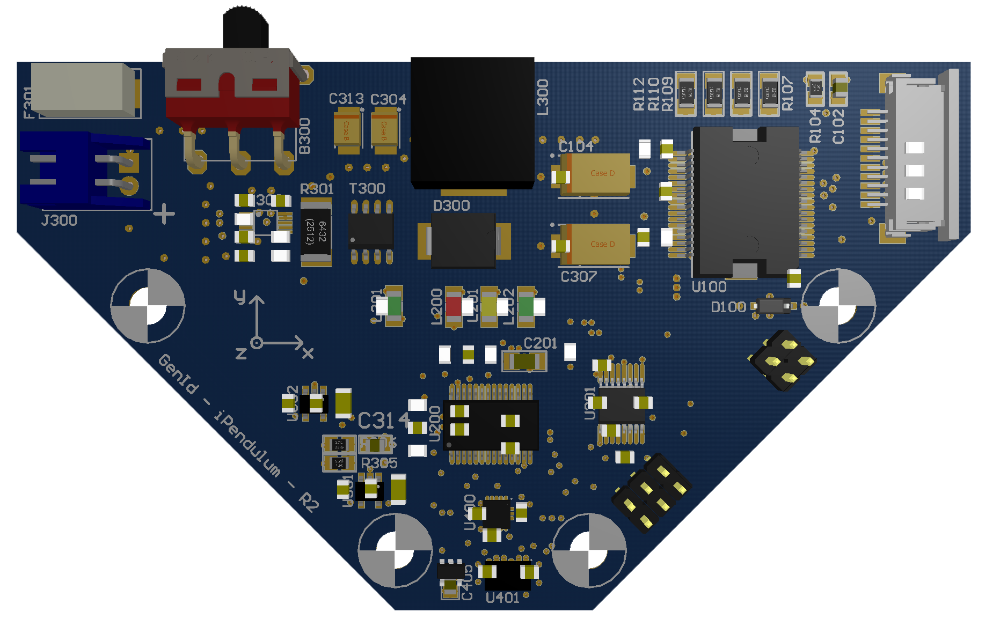
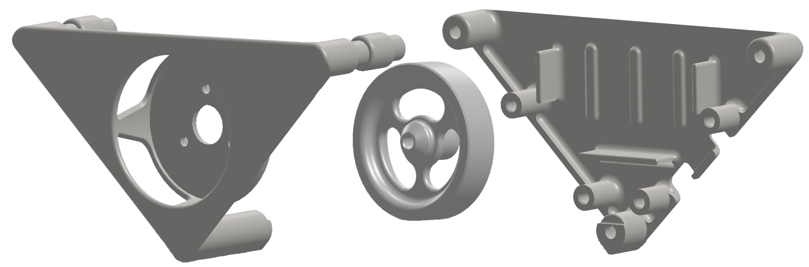
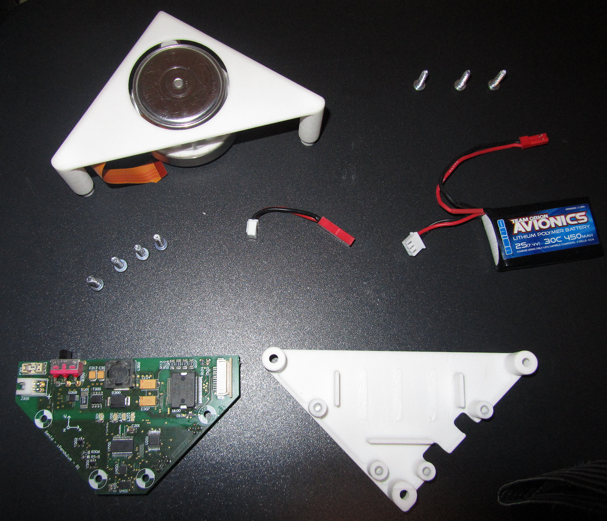
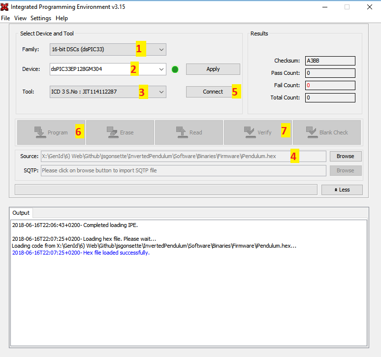

# Inverted Pendulum

**Wanna build an inverted pendulum ?** Like in this video :

you are in the right place. All what you need to known to get an incredible pendulum that jumps and balances is available here. I describe:

* how to make the *electronic board*
* how to make the *shell*
* how to get the *other components*
* how to program the *firmware*
* how to connect to the *Control Station software*

If you understand french, the long way explanation can be found [on my blog](https://jsgonsette.github.io/). Otherwise, keep reading.

## How to make the electronic board

### Get the BOM
First, you need all the electronic components on this [BOM list](./Electronic/BOM.xlsx). This kind of components can be found on different sites like:

* [Farnell](http://farnell.com/)
* [RS Components](http://www.rs-online.com/)
* [DigiKey](https://www.digikey.com/)

### Make the PCB
You need to make the PCB whose plans are given by the different files in this [directory](./Electronic/PCB).
(To be continued)

### Soldering of the components

Refer to this [implementation plan](./Electronic/PCB/PCB.PDF) to solder the different components on the both faces. With enough dexterity and patience, all the components could be soldered by hand with a soldering iron. **There are two exceptions**:

* U400 and U401 are only available in LGA package, which means: **no weldable legs !**

You have two options for those ones:

* either you are confident enough to use solder paste and an oven ;
* or you do it like me and you ask your PCB manufacturer to do it for you. This option is ofen available and you can save money by asking them to only solder those two components.

## How to make the shell

The shell of the pendulum is composed of three pieces, whose plans are given by the three STEP files in this [directory](./Mecanic/Shell)

* Back of the shell, holding the PCB and the battery
* Front of the shell, holding the motor
* The hub of the flywheel

They have to be 3D printed. You can do it yourself in case you have access to a 3D printer, or just use an online service like [Sculpteo](https://www.sculpteo.com). You need to upload the three STEP files, then to chose this material: [Nylon PA12 (Plastic)](https://www.sculpteo.com/en/materials/plastic-material/). Don't go to other materials, as it could change the weight of the pendulum ; **weight is important!**

## How to get the other components

Some additional parts are still needed before getting a functional pendulum.

* The metallic outer ring of the flywheel. It can be ordered on the [Misumi web site](https://uk.misumi-ec.com/). Use the reference **AWSM-D-D55-V48-T10** in the search box to land on the right page.
* The Maxon brushless motor whose reference is [EC45 Flat 200142](https://www.maxonmotor.com/maxon/view/product/200142), available on RS.
* The Lipo battery. The model is not so important, as long as the physical dimensions and the output voltage are respectively: 5x3x1cm and 7.5V. A possible choice can be found [here](https://www.guixmodel.fr/modelisme/accus-et-chargeurs/accus/lipo-2s/accu-lipo-450mah-2s-30c-kryptonium-detail).
* Seven screws to atttach the PCB in the shell and to tie the two parts of the shell together. Check this [Assembly BOM](Assembly%20BOM.xlsx).
* Three screws to attache the motor in the shell. Check this [Assembly BOM](Assembly%20BOM.xlsx).
* The cable to connect the PCB to the battery. You have to assemble it yourself. Check this [Cables BOM](./Mecanic/Cables%20BOM.xlsx).
* The cable to connect the pendulum to the PIC microcontroller programmer. You have to assemble it yourself. Check this [Cables BOM](./Mecanic/Cables%20BOM.xlsx).
* A Lipo charger. Personnaly, I'm very pleased with this charger.
* A Microchip programmation device like the [PICkit 3](https://www.microchip.com/Developmenttools/ProductDetails/PG164130), availabe on Farnell, for example.
* (optional) The cable to connect the pendulum to a serial cable. You have to assemble it yourself. Check this [Cables BOM](./Mecanic/Cables%20BOM.xlsx).
* (optional) a USB - Serial cable

## How to program the firmware

The brain of the pendulum is a small Microchip 16bits µC. You must load the right firmware inside to give life to the pendulum.

* Download and install [Microchip MPLAB X](http://microchipdeveloper.com/ipe:installation)
* Connect your chip programmer (like the PICkit 3 or the ICD 3) to the electonic board with the dedicated cable
* Connect your chip programmer to your computer
* Charge the Lipo battery and connect it to the electronic board
* Power up the electronic board by switching the power button: the green L301 LED should turn on
* Launch the application **MPLAB IPE**
* (1) In the *device family* field, select **16-bit DSCs (dsPIC33)**
* (2) In the *device* field, select **dsPIC33EP128MC202**
* (3) Ensure the *tool* field displays the name of your chip programmer correctly
* (4) In the source field, browse your computer to select the **iPendulum.hex** firmware, available here
* (5) Click on **Connect**
* (6) Click on **Program** to flash the microcontroller
* (7) Click on **Verify** to check the microcontroller content

### Test your flashed electronic board

(To be continued)

## How to connect to the Control Station software

The Control Station is a small program written in C# (tested on Windows only) enabling to connect to the pendulum through a serial connection.

(To be continued)
